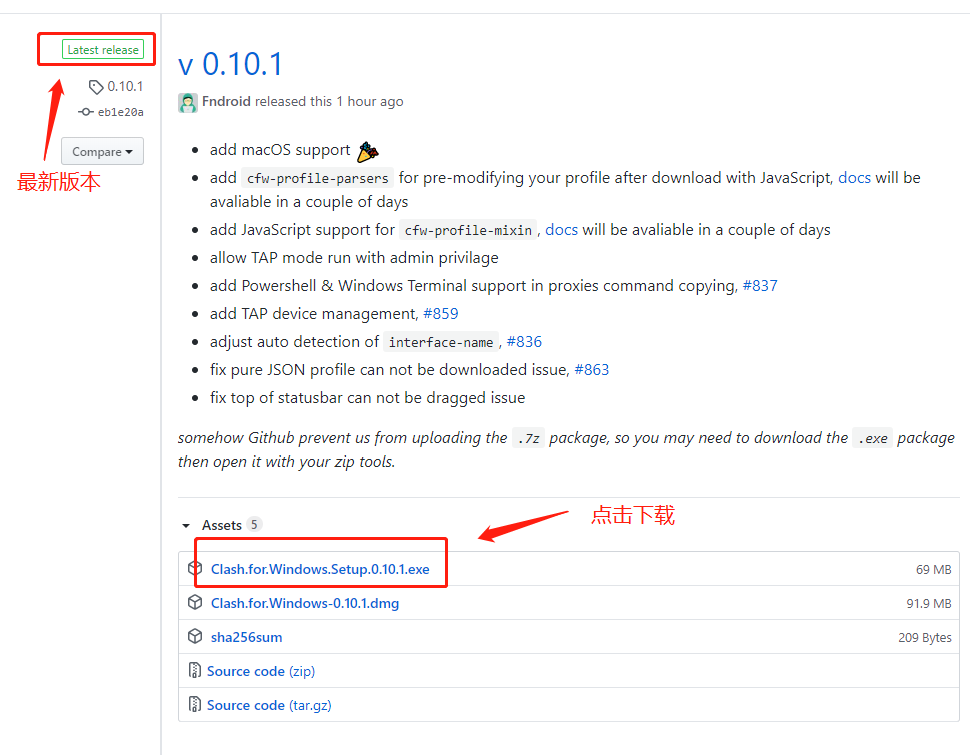

# Clash

## 什么是Clash

Clash是一个Go语言开发的**开源**多平台代理客户端，[Github](https://github.com/Dreamacro/clash)

## 下载地址 

* ClashX：Clash的Mac图形客户端，[Github](https://github.com/yichengchen/clashX/releases)
* ClashForAndroid：Clash的Android图形客户端，[Github](https://github.com/Kr328/ClashForAndroid/releases)
* Clash for Windows：Clash的Windows图形客户端，[Github](https://github.com/Fndroid/clash_for_windows_pkg)
* ~~Clash for IOS~~：目前没有IOS的客户端，**但是**，可以使用shadowsrocket（请咨询客服安装）

## 如何下载

以Clash for Windows为例：

打开此链接[Clash for Windows](https://github.com/Fndroid/clash_for_windows_pkg/releases)，选择版本进行下载：

## 

