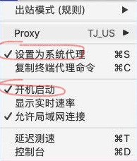

# ClashX for OSX

## 快速上手

### 启动

首次启动ClashX后会**系统顶栏**出现“小猫”图标代表启动成功：

## 导入配置文件

### 复制链接

1. 登入平台，点击“账号”，选择“订阅链接”
2. 选择“Clash”，点击“复制链接”

### 导入配置

1.右键系统顶栏的“小猫”，点击配置&gt;托管配置&gt;管理

2.打开托管的配置文件窗口，点击“添加”按钮

3.将上述复制的链接，粘贴到url中。config name填写200cat

## 打开系统代理与开机自启动

右键系统顶栏的“小猫”，勾选“设置为系统代理”和“开机启动”

## 切换线路

右键系统顶栏的“小猫”，选择“国外流量”，进行线路的切换

## 完成

现在，基本配置已经完成了

如果对软件进阶部分感兴趣，可以阅读之后的内容

